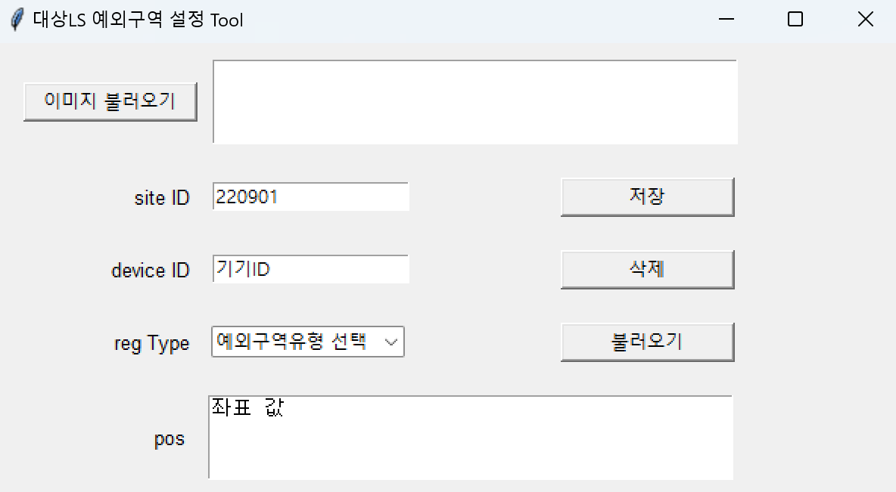

# 대상 LS 예외구역 설정 Tool

## Installation 설치방법
Windows CMD 창에서 실행

```shell
pip install -r requirements.txt
```

## 사용방법



---

### DB 주소 설정

```shell
[postgresql]
host=192.168.10.232     "DB의 ip 주소"
database=sidp3_nipa_ds  "DB 이름"
user=postgres           "로그인시 user 이름"
password=!123qwe        "로그인시 비밀번호"
```

database.ini 파일에 있는 주소를 사용하는 DB 주소에 맞게 변경해야함

---

### 데이터를 불러올 때 혹은 수정할 때

1. 확인하고자 하는 데이터의 Site ID(대상의 경우 220901 고정), Device ID, Reg Type(0 / 1 / 2)을 설정합니다.
2. 불러오기 버튼을 누르면 로컬 컴퓨터의 파일 시스템에서 이미지를 불러올 수 있습니다.
**이미지를 불러올 때 해당 장비의 이미지를 가져오는 것이 중요합니다. 다른 이미지를 불러오게 되면 다른 장비의 데이터가 변경되기 때문에 주의하셔야 합니다.**
3. DB에서 불러온 박스의 좌표값이 불러온 이미지 위에 그려집니다. 
4. **(데이터를 불러오기만 할 때)** 키보드 q를 누르게 되면 이미지 윈도우가 닫히면서 좌표 값 영역에 불러온 좌표 데이터가 표시됩니다.
5. **(수정할 때)** 지우고자 하는 박스 위에서 Shift키를 누른 채로 마우스 우클릭을 하면 해당 박스가 지워집니다.
6. **(수정할 때)** 박스를 지운 후에 마우스 좌클릭으로 박스의 좌표들을 하나씩 찍을 수 있습니다. 박스 하나를 그릴 때마다 s를 눌러 저장하시면 됩니다.
7. **(수정할 때)** 수정을 완료했다면 q를 눌러 이미지 윈도우를 닫고 저장 버튼 눌러 저장할 수 있습니다.

---

### 데이터를 삭제할 때
1. 삭제하고자 하는 데이터의 Site ID(대상의 경우 220901 고정), Device ID, Reg Type(0 / 1 / 2)을 설정합니다.
2. 삭제 버튼을 눌러 삭제할 수 있습니다.

---

### 데이터를 추가할 때
1. 이미지 불러오기 버튼을 누르면 로컬 컴퓨터의 파일 시스템에서 이미지를 불러올 수 있습니다.
2. 마우스 좌클릭으로 박스의 좌표들을 하나씩 찍을 수 있습니다. 박스 하나를 그릴 때마다 s를 눌러 저장하시면 됩니다.
3. 박스를 다 그렸다면 q를 눌러 이미지 윈도우를 닫고 저장 버튼 눌러 저장할 수 있습니다.

---

### DB 연결이 끊겼을 때
**(DB연결이 끊겼을 때에는 DB에서 데이터를 불러올 수 없으므로 불러오기가 안됩니다.)**

1. DB연결이 끊겼더라도 데이터는 data.json에 저장이 됩니다.
2. DB연결이 끊겼을 때에는 data.json 파일에 데이터 추가와 데이터 삭제 기능만 작동합니다.